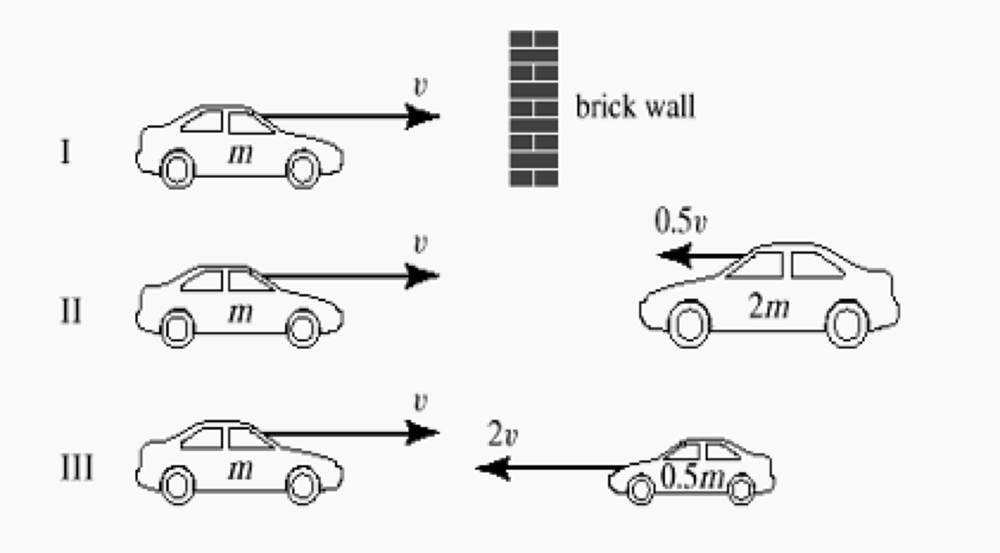

# Crash Cars II
If all three collisions to the right are <b>totally inelastic</b>, which one(s) will cause the most damage (in terms of lost kinetic energy)?

  

## Options
- Case I
- Case II
- *Case III
- Cases II and III
- All three

## Explanations
- In all cases the car on the left loses $\\frac{1}{2}mv^2$ of energy, but here the brick wall doesn't lose energy. This is actually the crash that is the <emph>least</emph> damaging, since in the other two cases, the oncoming cars lose energy, too.
- In this case, the car on the left loses the car on the left loses $\\frac{1}{2}mv^2$ of energy, while the car on the right loses $\\frac{1}{2} (2m)(0.5v)^2 = \\frac{1}{4}mv^2$. Worse than the brick wall, but this is not the worst case scenario.
- Yes, this is the worst case scenario, because the little car on the right has twice the velocity. Even though it has half the mass, the velocity 'counts' more since the loss of kinetic energy will be $\\frac{1}{2}(0.5 m)(2v)^2 = mv^2$. This is twice the energy lost by the car on the left, and four times the energy lost by the car in case II. The brick wall never loses any kinetic energy, since it didn't have any to start with.
- Consider how the kinetic energy lost scales with mass and velocity. There is a single worse case scenario.
- Consider how the kinetic energy lost scales with mass and velocity. There is a single worse case scenario.
