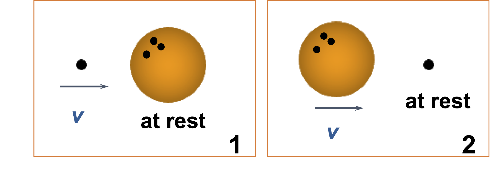

# Elastic Collisons I
Consider two elastic collisions:
<ol>
  <li> A golf ball with speed <var>v</var> hits a stationary bowling ball head-on.</li>
  <li>A bowling ball with speed <var>v</var> hits a stationary golf ball head-on.</li>
</ol>

In which case does the golf ball have the greater speed after the collision?

  

## Options
- Situation 1
- *Situation 2
- Both the same

## Explanations
- Not quite; the fastest the ping pong ball could rebound would be with a velocity of <var>v</var> again (this would be the case where the bowling ball just acts as a wall, sending the ping pong ball back again). Could the ping pong ball be sent just as fast, or even faster in situation 2?
- Yes, in this case, the bowling ball has <emph>much</emph> more momentum, and thus kinetic energy that it can transfer to the ping pong ball. From a mathematical point of view.
- Actually no, there is a clear winner. Consider the edge cases where the bowling ball has an extremely large mass. The ping pong ball will barely affect the speed of the bowling ball in either case, so what can we say about the ping pong ball's speed in each case?
