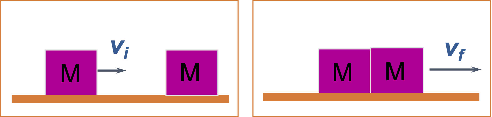

# Inelastic Collisons I
A box slides with initial velocity 10 m/s on a frictionless surface and collides inelastically with an identical box. The boxes stick together after the collision. What is the final velocity?

  

## Options
- 10 m/s
- 20 ms
- 0 m/s
- 15 m/s
- *5 m/s

## Explanations
- Remember that momentum must be conserved. For an inelastic collision (the boxes are sticking together), this means that there is only one final velocity: $$ m_1 v_{1i} + m_2 v_{2i} = (m_1 + m_2)v_f$$ What is $v_{2i}$ in this case?
- Remember that momentum must be conserved. For an inelastic collision (the boxes are sticking together), this means that there is only one final velocity: $$ m_1 v_{1i} + m_2 v_{2i} = (m_1 + m_2)v_f$$ What is $v_{2i}$ in this case?
- Remember that momentum must be conserved. For an inelastic collision (the boxes are sticking together), this means that there is only one final velocity: $$ m_1 v_{1i} + m_2 v_{2i} = (m_1 + m_2)v_f$$ What is $v_{2i}$ in this case?
-- Remember that momentum must be conserved. For an inelastic collision (the boxes are sticking together), this means that there is only one final velocity: $$ m_1 v_{1i} + m_2 v_{2i} = (m_1 + m_2)v_f$$ What is $v_{2i}$ in this case?
- Yes! Since momentum is conserved and the second box started at rest, conservation of momentum (and the fact that this is an inelastic collision) tells us that $$ m v_{i} = (m + m)v_f$$ and so $v_f = v_i/2$.
